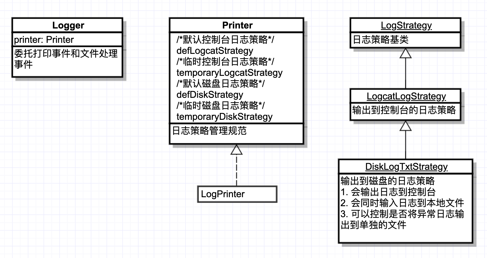

## 0x00 写在开始
这个项目是基于 Logger 做的二次开发



## USAGE Step 1

[REFERENCE](https://github.com/TomGarden/tom-notes/issues/8)

```Groovy
//ModuleName/build.gradle
dependencies {
    //lastVersion : https://github.com/TomGarden/lib_log/packages/316828
    implementation 'io.github.tomgarden:LibLog:lastVersion'
}

//ModuleName/build.gradle   OR    ProjectName/build.gradle
repositories {
    maven {
        url = uri("https://maven.pkg.github.com/TomGarden/lib_log")

        credentials {
            //不限的 github 账户名
            username = System.getenv("TOMGARADEN_USERNAME")
            //与 github 账户名成对的 具有 read:packages 权限的 token
            password = System.getenv("TOMGARADEN_READ_PACKAGES_TOKEN")
        }
    }
}

```

[check lastVersion](https://github.com/TomGarden/lib_log/packages/316828)

## USAGE Step 2

```kotlin
val justLogCat = "If you just want log to LogCat , you needn't any init"
Logger.i(justLogCat)


val version = "${BuildConfig.VERSION_NAME}[${BuildConfig.VERSION_CODE}]"
val wantLogCatAndLogDisk = "Log to LogCat & Log to disk , you need init Disk log format"
val diskLogTxtStrategy =
    DiskLogTxtStrategy.newBuilder()
        .tag(version)
        .logFilePath {
            val path = externalCacheDir?.path?.let { "${it}/logDir" }
            return@logFilePath path
        }
        .build()
Logger.setDefDiskStrategy(diskLogTxtStrategy)
Logger.d(wantLogCatAndLogDisk)
Logger.w("check local log file path : %s", Logger.getDefDiskStrategyLogFilePath() ?: "err")


val justDiskLog = "If you just want log to disk , you need clear defLogCatStrategy"
Logger.setDefLogcatStrategy(null)
    .d(justDiskLog)
```

----


## 0x01. 操作大纲
1. 查看 Issues 并修正力所能及的小问题
    - 兼容 AndroidX
    
2. 尝试将 adapter 的机制做某种替换, 最终要达到的效果:
    - 日志的默认输出效果是 defAdapter 的样式
    - 可以在输出日志的时候实时控制日志的输出格式 类似临时 adapter 的效果

## 0x02. 我认为事情应该是这样的

定义一个全局参数控制日志是否不做区分全部写入本地文件
DiskAdapter 无论全局参数如何定义都会将日志写入本地文件

DefTerminalAdapter

TemporaryTerminalAdapter

DefDiskAdapter

TemporaryDiskAdapter

我们不知道作者为什么要用一个 List 作为 Adapter 的容器, 但是想必自有他的道理吧 , 
如何才能做到在不影响当前 list 的情况下增加我们自己的这套逻辑呢?

- 要尝试做个另外的小模块来自定义一个 printer 即可完成这一需求
    - 要这样做的话 Logger 也需要做出响应的改动
    
## 关于[需要上传]的日志

关于需要上传的日志包含
1. 未捕获的异常们
2. 某些自定义信息们


通过单个文件存储日志异常日志
1. java 对本地文件的删除操作, 无法精细到对某一行的操作.
2. 通过数据库来管理异常又有些大动干戈.
3. 想要以 一个 异常为粒度进行操作一个比较合适的方式是
    * 每个未捕获的异常都单独存储在一个文件中

需要上传的日志也通过单个文件存储
1. 暂时没有找到更简便的方式同时兼顾下面的点
    * 具有人类可读性(xml , db 人类可读性较差)
    * 具有单个需要上传内容粒度的操作性(单个文件的 多 文本操作 , 操作成本高)


```java
//应用打开,发现本地有缓存的[需要上传]日志
if(检查本地是否缓存[需要上传]的日志/*[需要上传]日志*/){
    读取[需要上传]日志
    try{
        [需要上传]日志上传服务端
    }catch(Exception e){
        return;
    }
    
    删除已经上传的文件
}


//应用正常运行过程中发生[需要上传]
try{
    [需要上传]日志上传服务端
}catch(Exception e){
    [需要上传]日志本地化//上传服务端失败
}
```

## DONE
1. 日志位置应该随时可以通过工具调取
2. [通过 github packages 发布远程包](https://docs.github.com/cn/packages/publishing-and-managing-packages)
3. `Logger.i()` 的入参兼容性不够 , 考虑增加兼容性 , 记得反三(考虑其他 level 情况下的入参兼容性)
    ```
    出现问题的情况是 Logger.e(StringBuilder) , 至少应该兼容至 CharSequence , 甚至 Any?
    ```
4. 参照 Tetris 增加 ASSERT 日志逻辑


